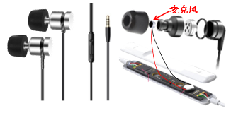
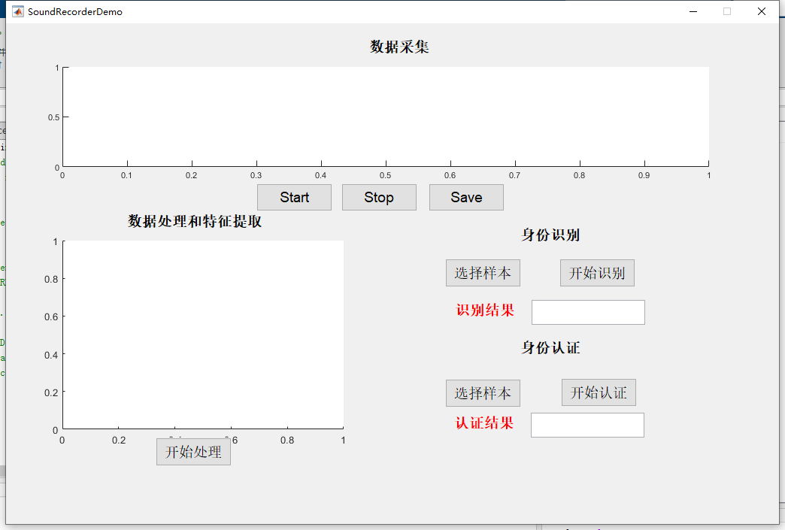

## **Research on low-cost identification and authentication based on Ear Canal Phonocardiogram**

The popularity of smart terminals and online payments has brought new challenges to data security and privacy protection. To benefited from the individual specificity of biological characteristics, biometric has natural security. Physiological signals, generated by organ activities, which depend on heredity and genes, have strong individual specificity. Therefore, identification and authentication based on physiological signals have unique advantages. However, the acquisition of physiological signals usually relies on special device, thus restricting the application of such technologies in mobile devices. In this regard, this paper uses wearable earphones to obtain the Ear Canal Phonocardiogram (EarPCG) generated by the heart beat in the ear canal, and proposes a low-cost identification and authentication system HeartID based on the EarPCG signal.

**matlab code folder**

1. A denoising method for EarPCG signal combining Ensemble Empirical Mode Decomposition (EEMD) and Wavelet Threshold Denoising (WTD) is proposed. This method decomposes the non-stationary EarPCG signal into Intrinsic Mode Functions (IMF) at different scales, and removes noise and interference in EarPCG from multiple scales

2. A heart rate variability elimination algorithm based on heartbeat cycle segmentation is proposed, and the EarPCG signal is divided into samples according to the heartbeat cycle to remove the influence of human heart rate changes

3. Extraction of Continuous Wavelet Transform (CWT) Features of Ear Canal Heart Sounds

**python code folder**

1. The feature mapping network HeartNet maps low-dimensional CWT features to high-dimensional feature spaces, thus providing greater individual distinction

2. Identification Network Based on EarPCG Signal

3. Authentication Model Based on Data Augmentation Strategy


#### Code Implementation Notes

**dictionary**

```
root
│  readme(chinese).txt
│  readme.md
│
├─matlab
│  │  preprocess.m
│  │  SoundRecorderDemo2.fig
│  │  SoundRecorderDemo2.m
│  │
│  └─utils
│          eemd2.m
│          estimate_hurst_exponent.m
│          peakdetact.m
│          wavedenoising.m
│
└─python
    ├─Authentication
    │  │  cutpaste.py
    │  │  dataset.py
    │  │  density.py
    │  │  eval.py
    │  │  gmm.py
    │  │  gmm_utils.py
    │  │  HeartNet.py
    │  │  model.py
    │  │  requirements.txt
    │  │  train.py
    │  │  utils.py
    │  │  utils_for_class.py
    │  │
    │  ├─eval
    │  ├─logdirs
    │  └─models
    │
    └─Identification
        │  HeartNet.py
        │  requirements.txt
        │  test.py
        │  train.py
        │  utils.py
        │
        ├─log
        ├─model
        └─result
```

**envs:** python 3.7 and matlab 2021a

**requirements**

```
einops==0.6.1
h5py==3.7.0
matplotlib==3.5.2
numpy==1.21.6
pandas==1.3.5
scikit_learn==1.0.2
seaborn==0.12.2
torch==1.7.1
torchvision==0.8.2
tqdm==4.64.0
joblib==1.2.0
Pillow==9.3.0
scipy==1.7.3
```


##### 1、Data collection

**device**



```
run ./matlab/SoundRecorderDemo2.m
click start，automatically end after 30s
click save to save the data(name:USERS***_xx)
```



**Dir Tree**

```
root
  └─原始数据
    ├─USERSxxx_01.mat
    ├─		...
    └─USERSxxx_xx.mat
```


##### 2、Data Processing and Feature Extraction

```
click 开始处理
choose root path（note: this is root path but not the data path）
The program will generate a Dataset folder in the root directory to save the generated cwt feature image
The generated cwt features will be displayed in the figure
```

**Path to CWT Feature**

```
root
  ├─Dataset
  │  └─USERSxxx
  │		...
  │  └─USERSxxx
  │      ├─testset
  │      ├─trainset
  │      └─validset
  ├─同步数据
  └─原始数据
```

##### 3、Identification and Authentication

**Identification**

```
Put the trained model into the model folder
Click to 选择样本
Select the cwt sample you want to test in the pop-up window
Click to 开始识别
```

**Authentication**

```
Put the trained model into the models folder
Click to 选择样本
Select the cwt sample you want to test in the pop-up window
Click to 开始认证
```

##### 4、Train model

**Identification**

```
In the code\python\Identification folder
run python train.py --dataset_path <dataset path>
```

**Authentication**

```
In the code\python\Authentication folder
run python train.py --trainpath <trainset> --evalpath <validset> --model_dir <model path>
```

##### 5、Test model

**Identification**

```
In the code\python\Identification folder
run python test.py --dataset_path <path of the dataset>
```

**Authentication**

```
In the code\python\Authentication folder
run python eval.py --trainpath <trainset(to choose threshold)> --evalpath <testset> --model_dir <model path>
```
#### Data
raw data and dataset can be downloaded from https://drive.google.com/file/d/1rzmYAlC3XPnA0OHMi_hl8HhkGEXdG--3/view?usp=sharing
